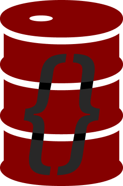

<a id="readme-top"></a>

# CRUDE



<br>

[![Contributors][contributors-shield]][contributors-url]
[![Forks][forks-shield]][forks-url]
[![Stargazers][stars-shield]][stars-url]
[![Issues][issues-shield]][issues-url]
[![project_license][license-shield]][license-url]

<br>

<details>
  <summary>Table of Contents</summary>
  <ol>
    <li>
      <a href="#quick-start">Quick Start</a>
    </li>
    <li>
      <a href="#api-reference">API Reference</a>
    </li>
    <li>
      <a href="#demo">Demo</a>
    </li>
    <li><a href="#tests">Tests</a></li>
    <li><a href="#schema-format">Schema Format</a></li>
    <li><a href="#notes">Notes</a></li>
  </ol>
</details>

<br>

`CRUDE` is a lightweight JSON-backed CRUD helper for small Python projects.

Install from PyPI with:

```bash
pip install crude-engine
```

It gives you:

- JSON file loading and saving
- dot-path key access like `profile.name`
- optional schema validation
- simple task execution through a safe action registry

## Quick Start

```python
from crude import Crude

store = Crude("data.json", "data_schema.json")

print(store.read())
print(store.get("name"))

store.update("age", 21)
store.save()
```

`Crude` supports dot-path keys for nested dictionaries:

```python
store.update("profile.name", "Ada")
print(store.get("profile.name"))
```

<p align="right">(<a href="#readme-top">back to top</a>)</p>

## API Reference

The tables below cover every method defined in `crude/core.py`.

### Lifecycle and Metadata

| Method | Description |
| --- | --- |
| `Crude(file, schema_file=None)` | Creates a store backed by `file`. If `schema_file` is provided, it is loaded once at initialization and used by `validate()`, `create()`, and `update()`. Missing or invalid JSON files fall back to empty data or `None` schema. |
| `__repr__()` | Returns a debug-friendly string such as `<Crude file=data.json keys=3>`. |
| `keys()` | Returns the top-level keys currently stored in memory as a list. |
| `reload()` | Replaces the in-memory cache with the latest JSON from disk and returns a deep copy of the refreshed data. |
| `save()` | Writes the current in-memory cache to disk and returns a deep copy of the saved data. |

### Reading Data

| Method | Description |
| --- | --- |
| `read(to_dict=False)` | Reloads the JSON file from disk without mutating the in-memory cache. Returns formatted JSON text by default, or a deep-copied dictionary when `to_dict=True`. |
| `read_cache(to_dict=False)` | Reads the current in-memory cache. Returns formatted JSON text by default, or a deep-copied dictionary when `to_dict=True`. |
| `read_schema(to_dict=False)` | Returns the loaded schema. With `to_dict=True`, it returns a deep copy of the schema object or `None`. Otherwise it returns formatted JSON text, which will be `null` when no schema file is configured. |
| `get(key, default=None)` | Returns a deep copy of the value at `key`. Supports dot-path access like `profile.name`. If the path cannot be resolved, `default` is returned. |
| `exists(key)` | Returns `True` when `key` exists in the cached data, including dot-path keys, otherwise `False`. |

### Writing Data

| Method | Description |
| --- | --- |
| `create(key, value, commit=False)` | Validates `value`, creates or overwrites `key` in the in-memory cache, and returns a deep copy of the full cached dataset. Intermediate dictionaries are created automatically for dot-path keys. Set `commit=True` to also save to disk. |
| `update(key, value)` | Validates `value`, writes it into the in-memory cache, saves to disk immediately, and returns a deep copy of the stored value at that key. Intermediate dictionaries are created automatically for dot-path keys. |
| `delete(key, commit=False)` | Removes `key` from the in-memory cache and returns `True` on success. Returns `False` if the path does not exist or cannot be resolved. Set `commit=True` to also save the deletion to disk. |

### Validation and Task Execution

| Method | Description |
| --- | --- |
| `validate(key, value, strict_schema=False)` | Validates `value` against the loaded schema and returns `True` when validation passes. If no schema is loaded, validation always passes. When `strict_schema=True`, missing schema paths raise `KeyError`; otherwise undefined keys are accepted. |
| `execute(key, registry, tasks=False)` | Executes actions stored in the JSON data using a registry of allowed callables. For a single action, `key` must contain a dictionary with an `action` field. With `tasks=True`, `key` must contain a list of task dictionaries and each one is executed in order. Unknown actions raise `ValueError`. |

Example registry for `execute()`:

```python
def greet(task):
    return f"Hello, {task['name']}!"

store.create("job", {"action": "greet", "name": "Ada"})
result = store.execute("job", {"greet": greet})
```

<br>

Schema-aware validation example:

```python
store.validate("profile.age", 21)
store.validate("unknown.path", "value", strict_schema=False)
```

### Internal Helpers

These methods are part of the module implementation and are not usually called directly, but they are documented here for completeness.

| Method | Description |
| --- | --- |
| `_load_json_file(path, default)` | Reads JSON from `path` and returns `default` when the file is missing, invalid, or the path is unusable. |
| `_write_json_file(path, payload)` | Writes `payload` to `path` as indented JSON. |
| `_resolve_path(key_path, data, create_missing=False)` | Resolves a dot-path into its parent dictionary and final key name. When `create_missing=True`, missing intermediate dictionaries are created. |
| `_format_json(payload)` | Returns `payload` as an indented JSON string. |
| `_validate_against_schema(key, value, schema, path=None)` | Recursively validates primitive values, nested dictionaries, and lists against the supported schema format. Raises `TypeError` or `ValueError` on invalid input or schema definitions. |

### Quick Examples

Top-level keys:

```python
print(store.keys())
```

<br>

Nested reads:

```python
print(store.get("profile.name"))
print(store.exists("profile.name"))
```

<br>

Create in memory, then save later:

```python
store.create("profile.active", True)
store.save()
```

<br>

Delete and persist immediately:

```python
store.delete("profile.active", True)
```

<p align="right">(<a href="#readme-top">back to top</a>)</p>

## Demo

Run the demo script:

```bash
python examples/demo.py
```

The demo uses temporary copies of `data.json` and `data_schema.json`, so the checked-in sample data is not modified.

<p align="right">(<a href="#readme-top">back to top</a>)</p>

## Tests

Run the unit tests (built-in `unittest`):

```bash
python -m unittest
```

<p align="right">(<a href="#readme-top">back to top</a>)</p>

## Schema Format

Primitive types use string names:

```json
{
    "name": "str",
    "age": "int"
}
```

Nested objects use nested dictionaries:

```json
{
    "profile": {
        "name": "str",
        "active": "bool"
    }
}
```

Lists can use one schema item as a template for all entries, or multiple items for index-based validation.

<p align="right">(<a href="#readme-top">back to top</a>)</p>

## Notes

- `read()` reloads from disk but does not replace the in-memory cache.
- `read_cache()` reads the in-memory state.
- `create(key, value)` changes only the cache unless `commit=True`.
- `update(key, value)` updates the cache, saves to disk immediately, and returns the stored value at that key.
- `delete(key, commit=True)` is the only delete mode that persists the removal to disk.
- `save()` explicitly writes the current cache to disk.
- `reload()` reloads the cache from disk.
- `validate()` and `execute()` are safe entry points for schema checks and registry-based actions.

<p align="right">(<a href="#readme-top">back to top</a>)</p>

[contributors-shield]: https://img.shields.io/github/contributors/tumbalcain/CRUDE.svg?style=for-the-badge
[contributors-url]: https://github.com/tumbalcain/CRUDE/graphs/contributors
[forks-shield]: https://img.shields.io/github/forks/tumbalcain/CRUDE.svg?style=for-the-badge
[forks-url]: https://github.com/tumbalcain/CRUDE/network/members
[stars-shield]: https://img.shields.io/github/stars/tumbalcain/CRUDE.svg?style=for-the-badge
[stars-url]: https://github.com/tumbalcain/CRUDE/stargazers
[issues-shield]: https://img.shields.io/github/issues/tumbalcain/CRUDE.svg?style=for-the-badge
[issues-url]: https://github.com/tumbalcain/CRUDE/issues
[license-shield]: https://img.shields.io/github/license/tumbalcain/CRUDE.svg?style=for-the-badge
[license-url]: https://github.com/tumbalcain/CRUDE/blob/main/LICENSE.md
